 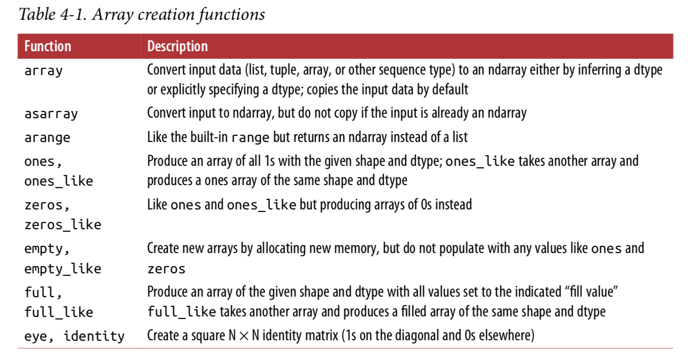

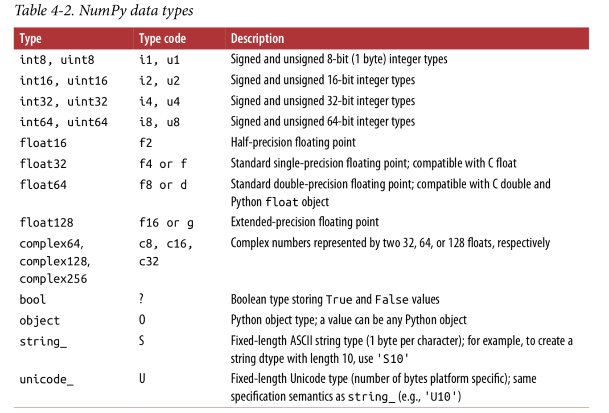

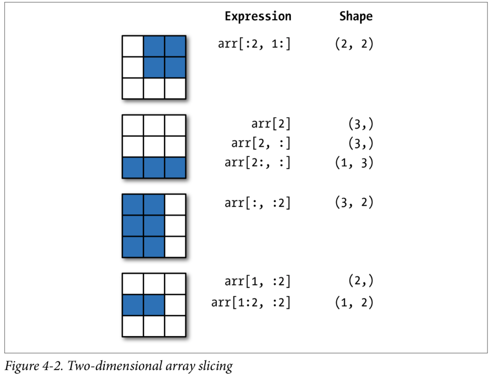

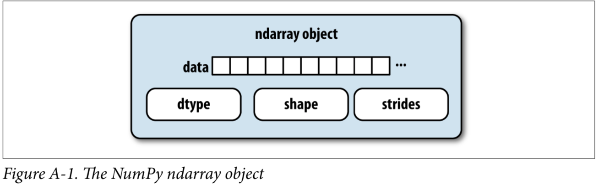

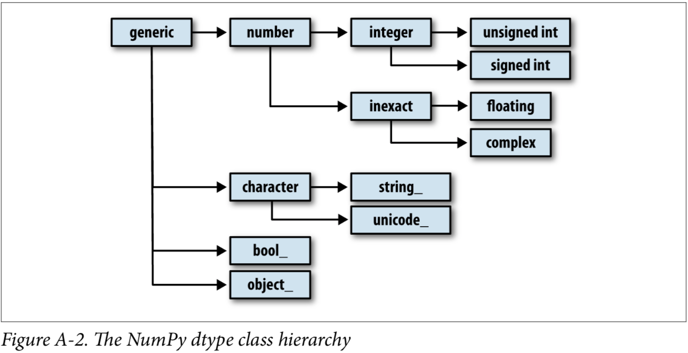

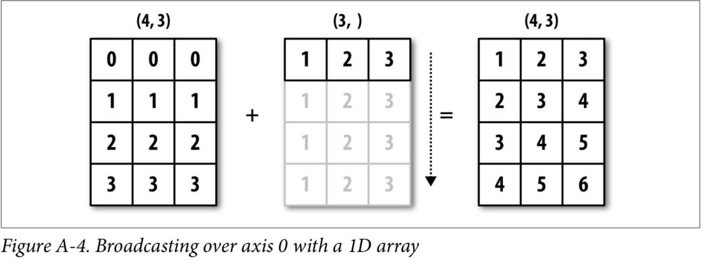

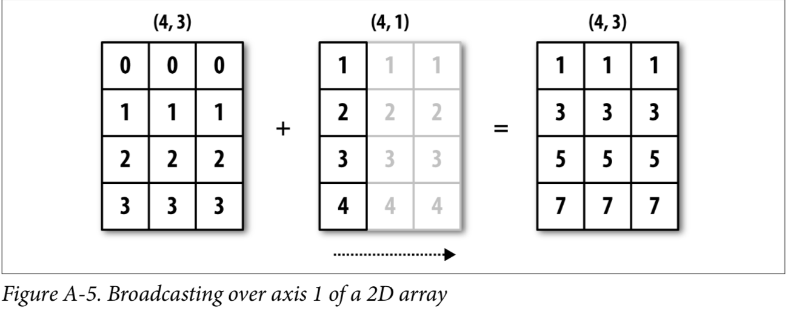

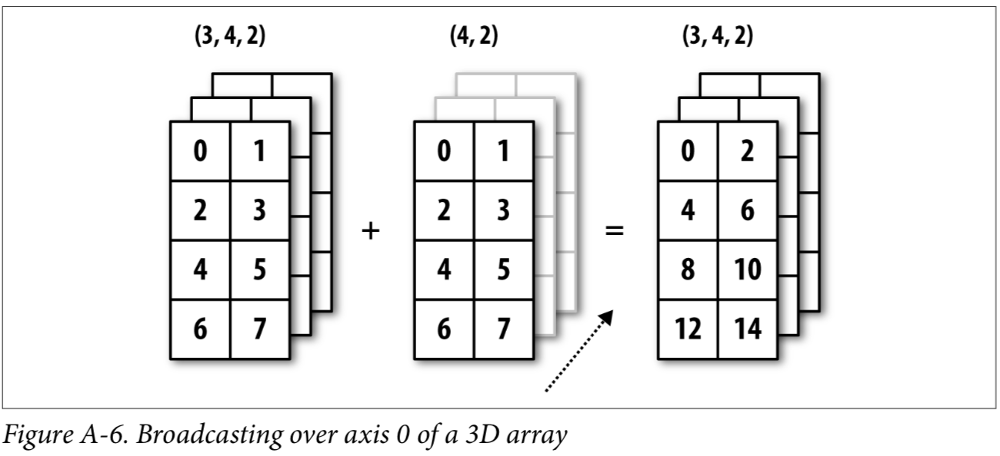

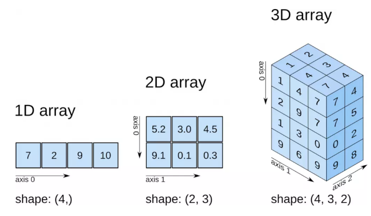

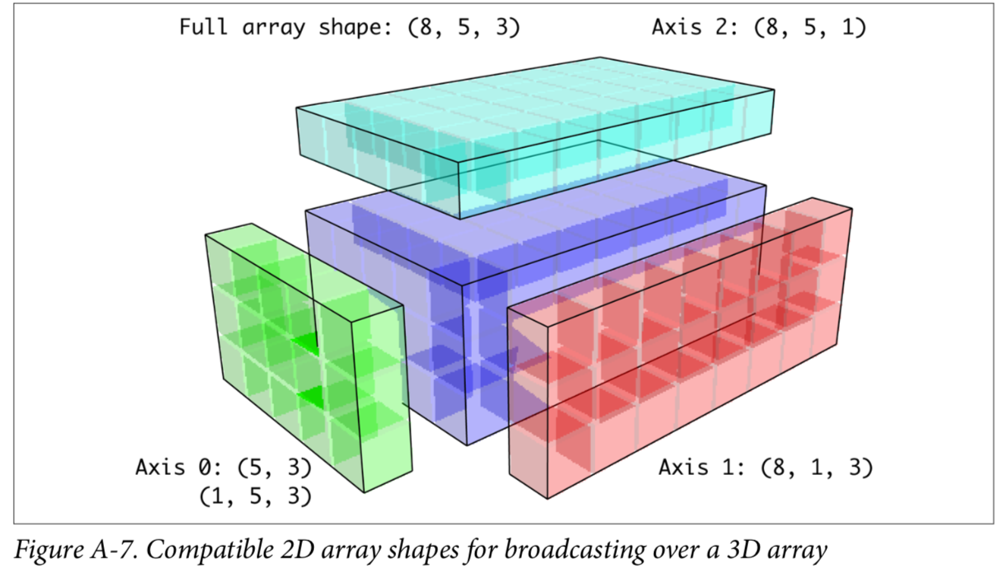

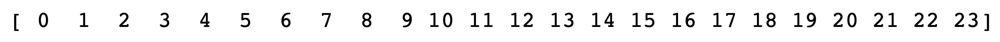

$$
\left [
\begin{matrix} 
0 & 1 & 2 & 3\\ 
4 & 5 & 6 & 7\\ 
8 & 9 & 10 & 11\\ 
12 & 13 & 14 & 15\\
\left [
\begin{matrix} 
a & b & c & d & e\\ 
f & g & h & i & j \\ 
k & l & m & n & o \\ 
p & q & r & s & t \\

\end{matrix}

\right ]
\end{matrix}

\right ]
$$

$$
\left [
\begin{matrix} 

\left [
\begin{matrix} 
0 & 1 & 2 & 3
\end{matrix}
\right ]
\\
\left [
\begin{matrix} 
4 & 5 & 6 & 7\\
\end{matrix}
\right ]
\\
\left [
\begin{matrix} 
8 & 9 & 10 & 11\\
\end{matrix}
\right ]
\\
\left [
\begin{matrix} 
12 & 13 & 14 & 15\\
\end{matrix}
\right ]

\end{matrix}
\right ]
$$

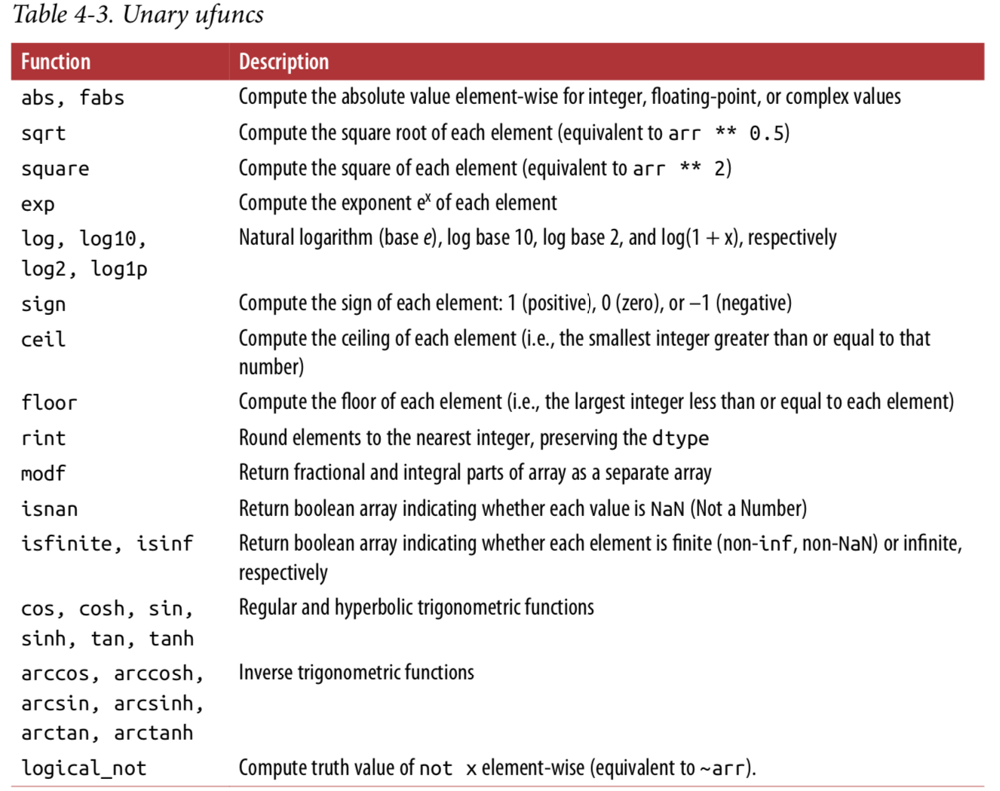

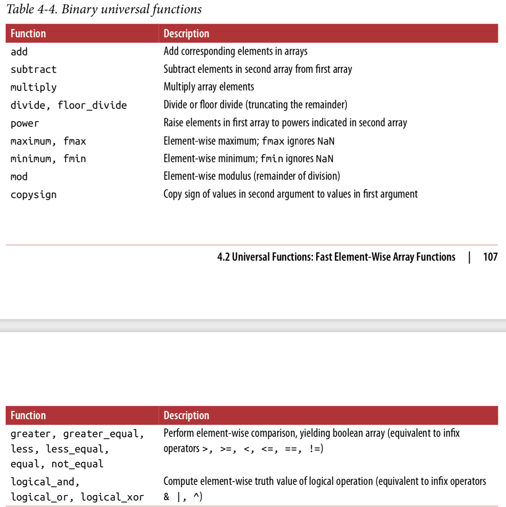

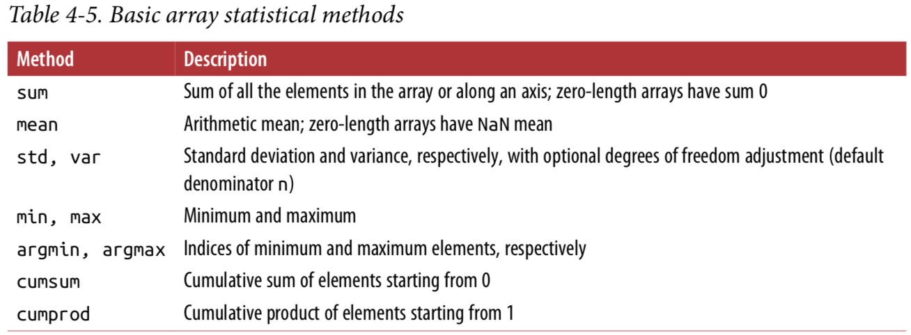

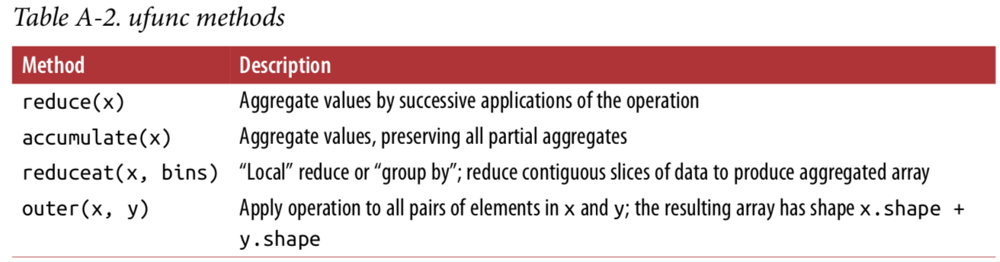

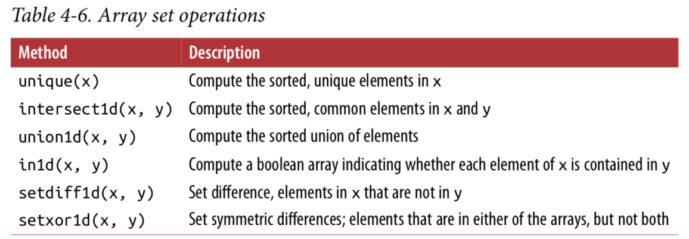

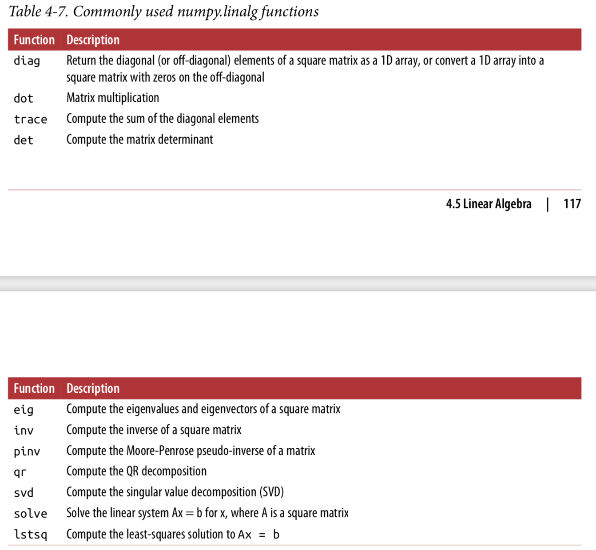

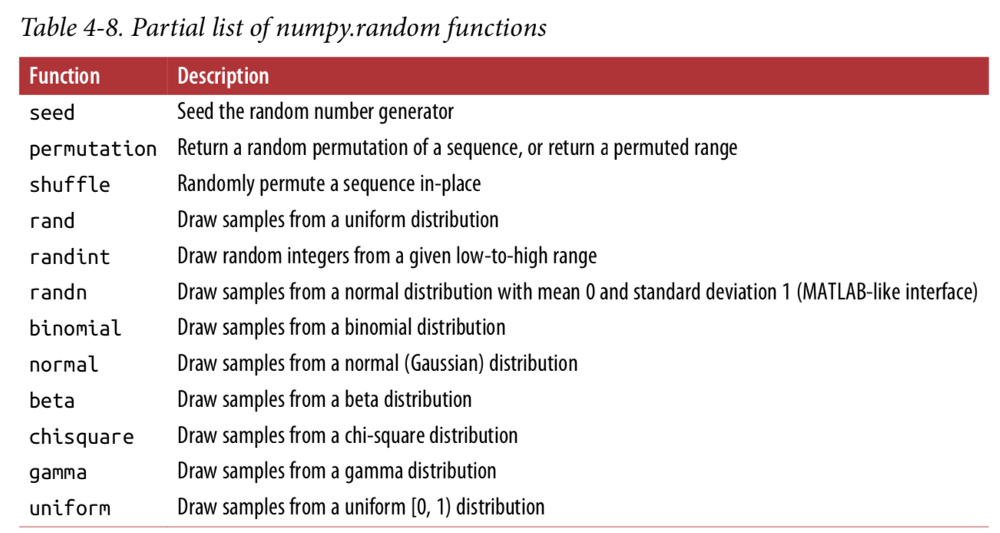