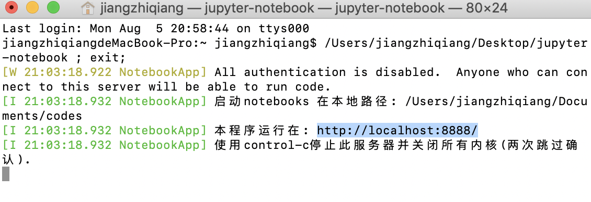

# task0
&emsp;&emsp;一天完成Jupyter notebook基础环境搭建，学习使用Git上传文件至Github。


# IPython and Jupyter

## IPython
&emsp;&emsp;IPython旨在建立一个更好的交互式Python解释器，如今已成为当前Python数据堆栈中最重要的工具之一。它本身不提供任何计算或数据分析工具，但提高交互式计算和软件开发能力。它鼓励执行 - 探索工作流，可以轻松访问操作系统的shell和文件系统。由于大部分数据分析编码涉及探索，试验和错误以及迭代，因此IPython可以帮助您更快地完成工作。<br/>

## Jupyter
&emsp;&emsp;Jupyter旨在设计与语言无关的交互式计算工具，目前支持40多种编程语言。在Python中，**jupyter**使用**kernel**（核）与ipython交互。<br/>

**Python pip 安装指令**

```
pip install jupyter notebook
```


在**Terminal**输入 `jupyter notebook`
或者运行**jupyter-notebook**程序，在**浏览器**输入：http://localhost:8888/

<br/>

进入**jupyter**，如下图所示。


因为我之前已经写过一些东西，所有存在这些内容，大家初始化完应当是空空如也。

点右上角的**新建**，即可创建你想要的内容


<br/>

新建一个python **notebook**文件，如下图所示。


jupyter notebook 支持代码，**markdown**，txt原生文件。

<br/>

# Github

Github用来托管文档（学习笔记，博客）和代码。<br/>
<a href="https://www.liaoxuefeng.com/wiki/896043488029600">Git教程 - 廖雪峰的官方网站</a>用于学习Git知识及相关指令。