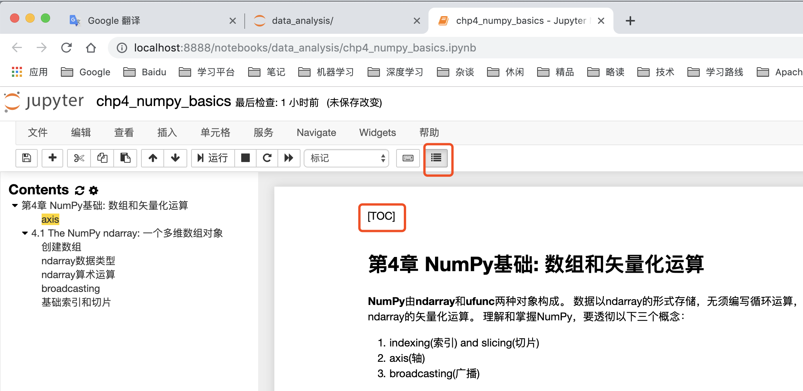

[TOC]

#【Task1精选问题】

## Q1：Jupyter的markdown可以像typora那样用[TOC]一键生成目录吗

第一步安装jupyter扩展包
&emsp;&emsp;pip install jupyter_contrib_nbextensions
第二步配置jupyter用户设置
注意：**关闭jupyter notebook**
&emsp;&emsp;jupyter contrib nbextension install --user --skip-running-check
第三步设置目录

第四步[TOC]生成目录

## Q2：numpy里有直接对多维数组求相关系数的命令吗? 
问题描述不明，求两个数组间的相关系数还是数组里每列的相关系数。
描述下相关函数吧
np.var()求方差$\sigma^2$，标准差$\sigma$开平方根即可($\sqrt{np.var()}$)
np.cov()求协方差
np.correlate()求相关系数

## Q3：arr = np.array([1, 2, 3, 4, 5])，教材显示arr的类型是dtype('int64')，而jupyter notebook显示结果为dtype('int32')，请问是由于什么原因导致的？

版本变迁……
我认为主要原因还是考虑数组所占空间的大小，改为了4个字节，毕竟c/c++，java int默认也是4个字节。

## Q4：学习中发现浮点数不能轻易比较，容易出错。eg:0.3==0.3 TRUE  (0.15+0.15 == 0.2+0.1) FALSE
见numpy-100 练习48
np.finfo(dtype).eps
np.float32的最小增量为1.1920929e-07
np.float64的最小增量为2.220446049250313e-16
由此可见浮点数在计算机内存表示其实是不精确的，有最小增量，所以一般比较会加一个范围值，例如$e^{-5}$。
为什么浮点数表示不精确？
最直观的解释是数据在计算机内部以0，1表示，位数有限，而浮点数是无限的。用有限的数编码无限的数，肯定不能全部概括，且存在最大值，最小值和最小增量。
关于浮点数在计算机表示的理论和规范，大家可以看下**IEEE754**。

## Q5：Numpy下的这么多函数和使用方法需要全部熟记吗？哪些知识点Numpy库核心?有必要掌握诸如生成伪随机数这类知识点吗?还是等用到的时候再去看文档说明呢?个人更倾向于后者.

将书上的代码先理解，理解numpy的核心思想及功能，其余的知识点等到你有需要时再去查询相关文档、博客和论坛。

## Q6：max()和argmax()怎么理解？

max()求数组中的最大值
argmax()求数组中的最大值的索引值

## Q7：在学习第四章时有的数组后面跟着方法，有的直接np后面带着函数输入参数，这两种有什么不同吗？
np.ufunc是类方法(class method)
arr.ufunc是实例方法(instance method)
类方法比实例方法多了个参数:arr，但其余参数都一致，本质上都执行相同功能
因为python是解释性语言，而在jupyer默认没有载入JIT(动态即时编译)，因此不知道对象的类型，没有编码提示。
查询函数说明，可以查看文档
需要更好的编码提示，可以在IDE(例如Pycharm)编码。