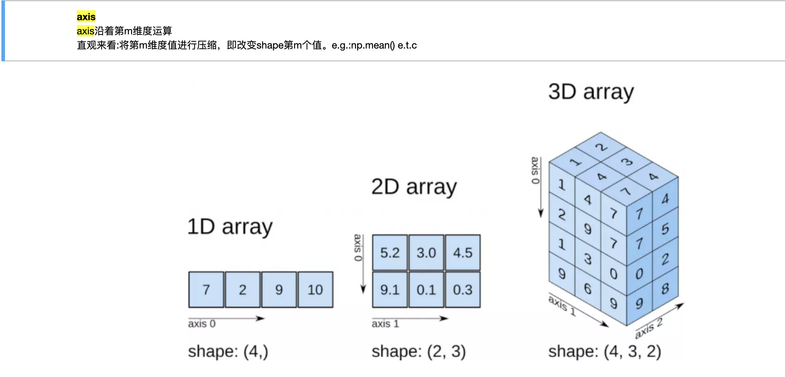

### 有序dict

跟索引底层的实现机制有关

dict或者hash set本身是无序的，而在python3.6版本及以后使用类似OrderedDict结构维护了输入时的顺序。


#【Task2精选问题】

## Q1：pandas有什么好的方法来解决读入好几G文件时内存不足？ 

分多次将磁盘上的文件读入内存中(**分块读取**)，以便接下来的数据处理工作。

读取文件时指定参数**chunksize**的大小，以及设置**iterator**=True

```python3
import pandas as pd
path = 'datasets/titanic/train.csv'

reader = pd.read_csv(path, chunksize=100, iterator=True)  # return TextParser
print(type(reader))  # TextParser

# # 单次获取
# chunk = reader.get_chunk(size=100)
# print(chunk.head(5))

# 迭代获取
for chunk in reader:
    # deal data by chunk
    print(chunk.head(5))

```
<br/>


## Q2：（1）：iloc()和 loc()这两个索引方式一个是左闭右开，一个是左闭右闭，容易混淆。（2）fillna()，fill_value是否是一样
(1)iloc使用数字索引，跟range()中start, end, step的用法一致:[ )<br/>
loc使用标签索引，因为是标签且标签不一定按顺序排列，所以包含两个区间顶点值:[ ]<br/>
注：数字也是标签，所以loc也可以按数字索引，但是不建议混合使用。<br/>

(2)
提问中应为**fill_value**，而不是fill_values
fill_value为参数，fillna为ufunc（函数），其作用都是填充NA值
<br/>


## Q3：检测缺失值用isnull(),但对于大量数据时，有什么办法可以方便看出来呢

`df.info()`描述基本统计信息
<br/>


## Q4：在用传入axis=1按行进行求和运算时，NA值没有自动排除，出来的结果是0.00。没有搞明白是哪出了问题。
在我运行的代码中，NAN不参与运算，或者当作0
```python3
import numpy as np
import pandas as pd
df = pd.DataFrame([1, 2, np.NAN])  # 3.0
print(df.sum())

df = pd.DataFrame([np.NAN])  # 0.0
print(df.sum())
```
<br/>


## Q5：为什么在语句 data.unique() 后print (data)仍是原来的data内容，只有data1=data.unique()后，才可以得到想要的结果。

data.unique()并**不在**原数组上直接操作，而是将操作的结果**返回**，所以需要**赋值**才能保留操作的结果。
<br/>


## Q6： dataframe中的axis参数怎么确定在哪个方向上进行操作?
默认**aixs=0**（沿行方向）<br/>
axis的设置同**NumPy**中**ndarray**一致，可返回第四章再详细看看，以下给出简单的示意图。

<br/>


## Q7： DataFrame的apply()、applymap()、map()三个方法的区别是什么？分别在什么场合使用？

**调用对象不同**,
**df**.apply()和**df**.applymap()
**series**.map()<br/>
**作用都是映射数组**，apply(axis=1)等价于applymap()
所以根据方便和你的编程习惯使用它们就好啦！
<br/>