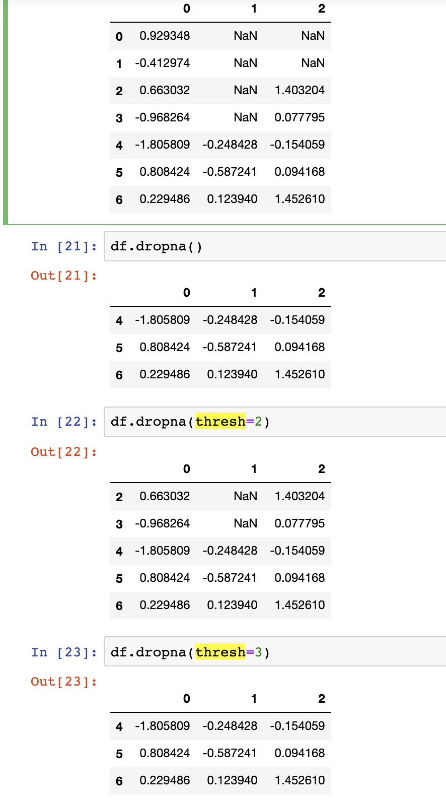
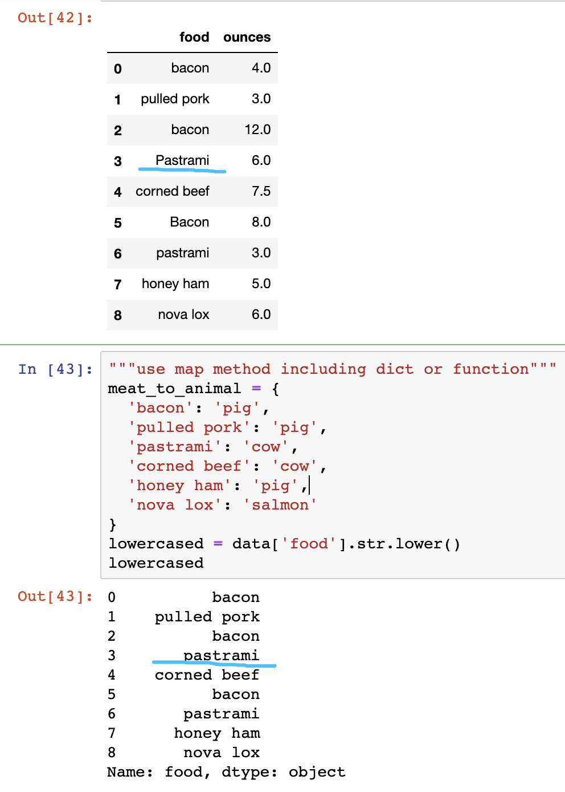

#【Task4精选问题】

## Q1：_ = df.fillna(0, inplace=True)中的_是什么用法？
_是**变量名**，用来表示这个变量**无实际含义**，作用等价于**临时变量**。

 

## Q2：请问哑变量在实际数据分析中在什么情况下会运用到呢？

哑变量就是**保存**自定义生成的数据，存储这些信息有利于我们进一步利用数据。

例如在学生成绩管理系统中，输入只有每个的学生成绩，我们可以计算他们的平均成绩，求每个人的绩点，以待评奖评奖时参考。

 

## Q3：1. df.any()选项中，如axis=1，是否对应的行只有在所有的值都不满足要求时才返回False？2. 如果数据集的某个列有多个分类，除了pandas.get_dummies函数之外，有没有其他的方法可以实现类似的编码？

1. **Pandas**中df.any(axis=1)与**NumPy**arr.any(axis=1)用法一致，含义皆为每行是否**存在**True
all()则判断是否**全**为True
2. **sklearn**中针对不同的对象(Integer, String)，采用不用的编码器实现**one-hot编码**
e.g.OneHotEncoe.g, LabelEncoder, LabelBinarizer, MultiLabelBinarizer
pandas.get_dummies()直接实现**one-hot编码**，无需考虑对象类型，但使用时需注意**sklearn**中tranform()的兼容性。

 

## Q4： "dropna()中的thresh到底是什么用？
parameter:thresh,保留**非NA**数据**达到**thresh个的行

 

## Q5： lower = data['food'].str.lower() 原理是什么，是要字母排序？

lower = data['food'].str.lower()将'food'字符串全转为**小写字母**

