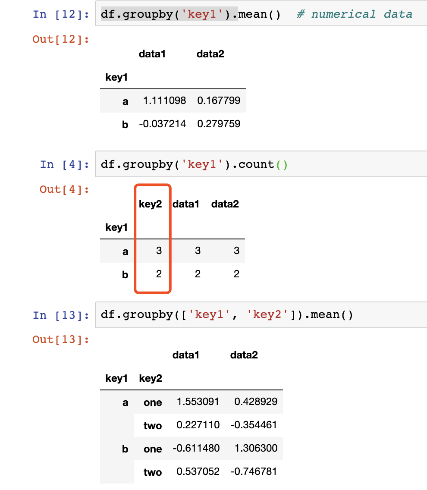

#【Task6精选问题】

## Q1： 第一节，df.groupby('key1').mean()为什么key2没有被识别为数据呢？如果不是mean()而是别的函数就会是被识别为要group的数据呢？
其实**key2**也按key1的值**分组**

- 但由于df.groupby('key1').mean()做均值计算，因为key2是字符串，没有均值的结果，所以不显示。
- 当你使用group.count()——统计数据个数，即可看到关于**key2的结果**




<br/>


## Q2： df.groupby(['key1','key2'])[['data2']].mean()和s_grouped = df.groupby(['key1','key2'])['data2'];s_grouped.mean()的区别，为何后者传入的是单个列名。
代码含义求**按key1，key2分组以后data2列的平均值**<br/>
s_grouped只是个中间变量，两者写法等价


<br/>


## Q3： 一般对缺失值填充主要用什么方式来确定要填充均值或者中值或者其他方式呢？？毕竟不合理的填充会引起更大的噪声
看**个人**对业务或者工程的**理解**，个人觉得用均值的场景多一些<br/>
此外数据分析，处理和特征工程是一个**探索**的过程<br/>
因此将**数据可视化**对查看数据分布，填充缺失值有一定帮助。

<br/>


## Q4： get_suit = lambda card: card[-1] 这个lambda是怎么使用呢?
lambda：匿名函数<br/>
card为参数,card[-1]为返回值<br/>
这个函数作用是取序列的最后一个值，在书中示例是取字符串的最后一个字符<br/>
显示等价形式
```Python3
def get_last(card):
	return card[-1]
```
<br/>

## Q5：GroupBy中agg()函数和apply()函数的区别

group.agg(func)和df.apply(func)都接受一个函数作为参数，是group的高级用法
- group.agg(func)：func返回一个值
- group.apply(func)：func返回一个dataframe