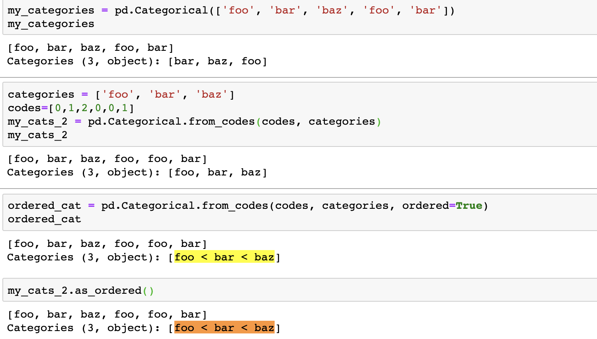

#【Task7精选问题】

##Q1：想了解下pandas库迭代的业务需求都是哪些方面的?换句话说，如果pandas是数据分析的利器，那么作为数据分析的从业者想了解工作相关的前沿信息有什么好的渠道或者平台推荐吗？

pandas用于**数据分析**

1. 考虑自己找数据分析，例如股票行情分析
2. 学习python爬虫，获取数据
3. 看统计数学，掌握分析的相关数学理论
4. 看数据分析有关需求和业务的书籍，例如睿姐在群里发的《精益数据分析》
5.  迈入机器学习，走向kaggle之路

个人浅见，还未就业，望各位大佬指点明路
<br/>


## Q2：除GroupBy函数外，还有哪些分类函数，相比起来优缺点有什么？

<a href="https://www.jianshu.com/p/42f1d2909bb6">超好用的 pandas 之 groupby
</a>

Df.groupby()返回**DataFrameGroupBy**对象，方便对每组对象操作<br/>
`Categories`分类类型<br/>
其他的例如`cut()`和`qcut()`与其说是分类，更准确的说是**统计**。
<br/>


## Q3："f(df)和df.pipe(f)是等价的，为什么说pipe使得链式声明更容易? pipe的原理或本质是什么？"
```python3
#Consider a sequence of function calls:

a = f(df, arg1=v1)
b = g(a, v2, arg3=v3)
c = h(b, arg4=v4)

result = (df.pipe(f, arg1=v1)
          .pipe(g, v2, arg3=v3)
          .pipe(h, arg4=v4))
```

链式调用，编码更便捷，代码更易懂<br/>

pipe就是数据管道，返回特定类型，实现代码的一次性处理
<br/>


## Q4：无序分类实例也会有[foo < bar < baz]。通过整数输出形式也会有排序，那么无序体现在哪？

这个问题是在说这个吗？

不是无序排序，而是**指定顺序排序**。不指定顺序，**默认字典顺序排序**。
<br/>