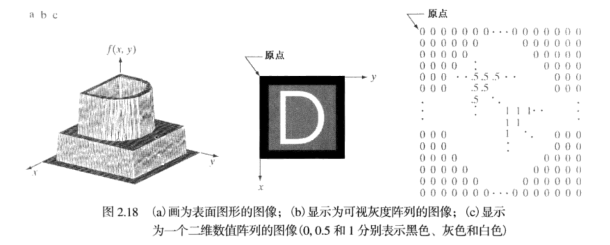
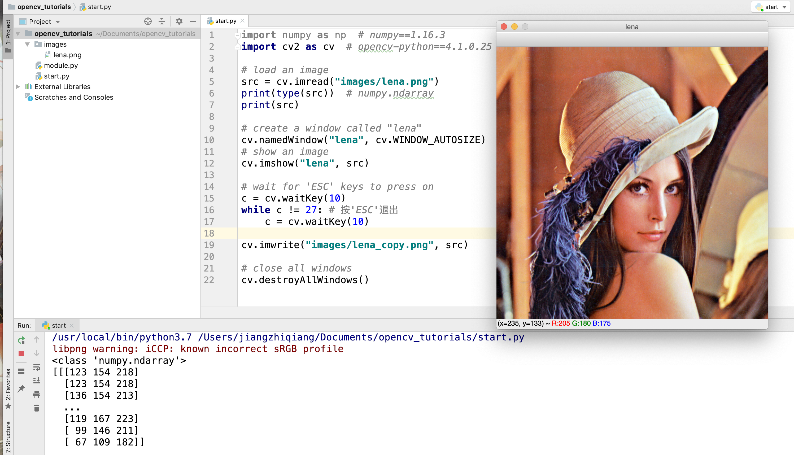

# （一）数字图像基础
<br/>
## 数字图像及处理
&emsp;&emsp;**数字图像**(Digital Image)定义为一个二维函数f(x, y)，其中(x, y)为平面坐标，f(x, y)为这一点的灰度值，坐标和灰度离散且有限，坐标系以图像的左上角为原点，如图1.1所示。
$$
A=\left[\begin{array}{cccc}{a_{0,0}} & {a_{0,1}} & {\dots} & {a_{0, N-1}} \\ {a_{1,0}} & {a_{1,1}} & {\dots} & {a_{1, N-1}} \\ {\vdots} & {\vdots} & {} & {\vdots} \\ {a_{M-1,0}} & {a_{M-1,1}} & {\dots} & {a_{M-1, N-1}}\end{array}\right]
$$

$$
\large{图}\small{1.1} \,  M \times N \, \large{数字图像}
$$




&emsp;&emsp;**数字图像处理**(Digital Image Processing)借助于数字计算机处理数字图像，一般输入是数字图像，输出是数字图像或者数字图像的特征。
<br/>

## Numpy & OpenCv
&emsp;&emsp;Numpy是有名的矩阵计算库，底层基于C++实现，提供Python接口，编程便捷，运行效率高。

&emsp;&emsp;OpenCv是Python有名的视觉开源库，基于Numpy，底层同样用C++实现，提供Python接口，编程便捷，运行效率高。

本系列代码基于Python3.7和OpenCv4.0环境。pip安装指令如下所示。

```cmd
pip install numpy==1.16.3
pip install opencv-python==4.1.0.25 
```
<br/>


## 图像的加载、保存及显示



完整代码如下所示：

```python
import numpy as np  # numpy==1.16.3
import cv2 as cv  # opencv-python==4.1.0.25

# load an image
src = cv.imread("images/lena.png")
print(type(src))  # numpy.ndarray
print(src)

# create a window called "lena"
cv.namedWindow("lena", cv.WINDOW_AUTOSIZE)
# show an image
cv.imshow("lena", src)

# wait for 'ESC' keys to press on
c = cv.waitKey(10)
while c != 27: # 按'ESC'退出
    c = cv.waitKey(10)

# close all windows
cv.destroyAllWindows()
```

**注意**：
注意图片存放路径，若imread()没有加载到正确的路径，不会报异常，而是返回**None**。
<br/>

## 图像运算
图像在计算机内部表示为由0和1组成的二维数组。
### 阵列运算
阵列运算为逐元素运算。
- 算术运算：cv.add, cv.subtract, cv.mutiply, cv.divide等，对应NumPy的np.add等运算。
- 逻辑运算：cv.bitwise_and , cv.bitwise_or, cv.bitwise_not等。

### 矩阵运算
矩阵运算为矩阵整体运算。
- 矩阵乘积cv.dot等

<br/>
## 图像色彩空间及分类
最常见两个图像的色彩空间有RGB，HSV，其他色彩空间如HIS，YCrCb，YUV(常用于Android开发)。
OpenCv提供了 `cv.cvtColor(img, flag)`，flag表示图像的转换

**二值图像**：图像值只有0，1，0为黑，1为白。一般通过设置阈值，将一幅图像转换为二值图像。

**灰度图像**：根据灰度级数，设置的图像像素值。例如8级灰度图像有0-255共256个值。`flag=cv.COLOR_BGR2GRAY`表示将BGR图像转换为灰度图像。

**彩色图像**：在不同的颜色分量，设置不同的灰度值，一起叠加形成的效果图。一般为3个通道。
在OpenCv中RGB色彩空间顺序为**BGR**，而在Matplot中RGB色彩空间顺序仍为RGB。`flag=cv.COLOR_BGR2HSV`表示将BGR图像转换为灰度图像。其他flag可以进行其他的色彩空间转换。


